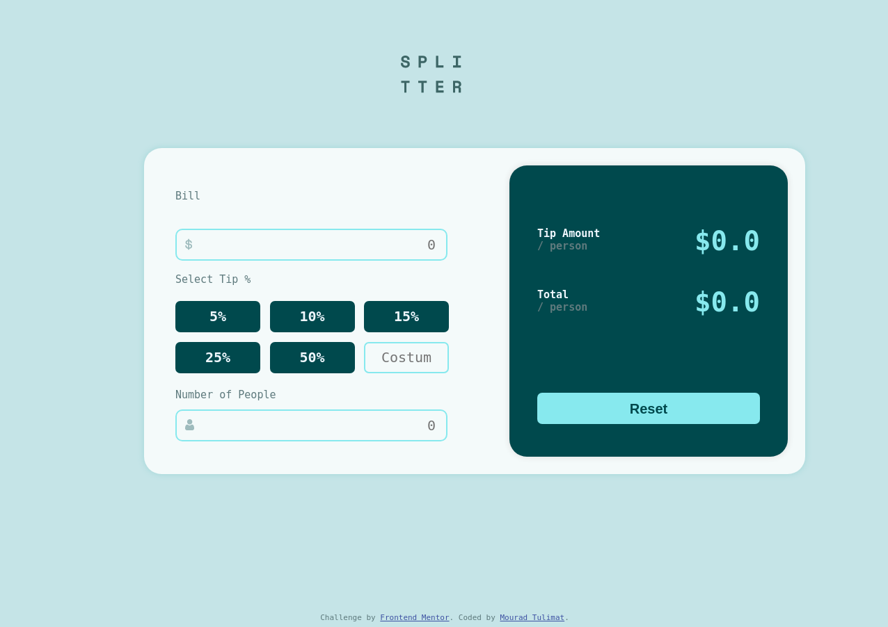

# Frontend Mentor - Tip calculator app solution

This is a solution to the [Tip calculator app challenge on Frontend Mentor](https://www.frontendmentor.io/challenges/tip-calculator-app-ugJNGbJUX). Frontend Mentor challenges help you improve your coding skills by building realistic projects.

## Table of contents

- [Overview](#overview)
  - [The challenge](#the-challenge)
  - [Screenshot](#screenshot)
  - [Links](#links)
- [My process](#my-process)
  - [Built with](#built-with)
  - [What I learned](#what-i-learned)
  - [Continued development](#continued-development)
  - [Useful resources](#useful-resources)
- [Author](#author)

**Note: Delete this note and update the table of contents based on what sections you keep.**

## Overview

### The challenge

Users should be able to:

- View the optimal layout for the app depending on their device's screen size
- See hover states for all interactive elements on the page
- Calculate the correct tip and total cost of the bill per person

### Screenshot

### Links

- Solution URL: [Add solution URL here]()
- Live Site URL: [Add live site URL here](https://m0vr4d.github.io/tipcalcFEM/index)

## My process
- I had no prior experience as I mentioned so I had to google my way through ...
- I didn't know about making costume fonts families or colors until I was finishing up, so I missed up there.
- I'm happy with my positionings, however I'm not at all happy with the way I did it, it's basically unreadable, but it  got the job done, so I think I could improve there, would appreciate any feedback! even though I think the most honest feedback would be to delete the css file and rewrite the whole thing.
- I didn't struggle with JS that much, it was the easiest part actually, and I think I did kinda nice job there, but again.. any feedback is appreciated.
### Built with

- HTML5
- CSS
- vanilla js

### What I learned
- I can skip this section, every thing I wrote int this project is something I learned in the past 4 days :)

### Continued development

- I'm gonna try my hardest to organise my css and html code in my future projects, I think watching profs on YouTube might help, while getting my hands dirty.
- gonna try another frontendmentor Junior project
- maybe learn more about js functionalities it looked like there is so much more to learn even though I have a competitive programming background with c++, I think this is more of a far future quality

### Useful resources

- Kevin Powell on youtube was a great help + he showed my how little I'm in the front-end word and how much I can improve
- w3schools for sure

## Author

- Frontend Mentor - [@m0vr4d](https://www.frontendmentor.io/profile/m0vr4d)
- facebook - [@mourad.touliemat](https://www.facebook.com/mourad.touliemat)
